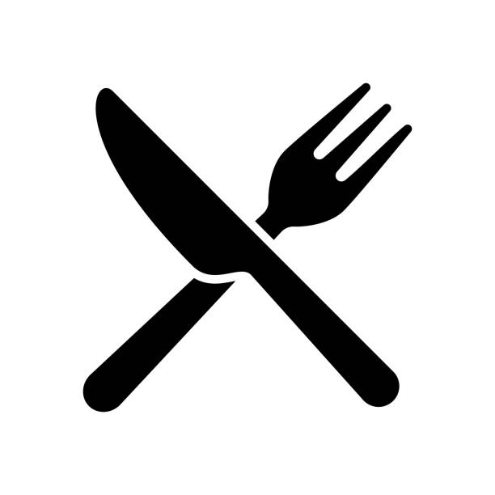

# NutriLog

NutriLog is a modern nutrition tracking web app. It allows users to snap a photo of their meals and instantly get calorie, macro, and nutritional data.

  

---

## Techstack

- Auth/Database: [Supabase](https://supabase.com/)
- Frontend/Backend: [Next.js 14 (App Router)](https://nextjs.org/)
- Deployment: [Netlify](https://www.netlify.com/)
- UI Components: [Tailwind CSS + shadcn/ui](https://ui.shadcn.com/docs)
- Image Analysis: [AWS Rekognition Custom Labels](https://aws.amazon.com/rekognition/custom-labels/)
- Testing: [Vitest](https://vitest.dev/)

---

## How to Install

NutriLog runs fully in the browser; no native install is required.

### Mobile App

- **iOS Safari**
  
  1. Open [nutrilogging.netlify.app](https://nutrilogging.netlify.app/) in Safari.
  2. Tap Share, choose Add to Home Screen, then tap Add.

- **Android Samsung Internet**
  
  1. Open [nutrilogging.netlify.app](https://nutrilogging.netlify.app/) in Samsung Internet.
  2. Tap the menu in the bottom left, select Add page to > Home screen, and confirm.

- **Chrome Browser (iOS or Android)**
  
  1. Open [nutrilogging.netlify.app](https://nutrilogging.netlify.app/) in Chrome.
  2. Tap the three-dot menu, choose Add to Home screen or Install app, and confirm.

### Mobile/Desktop Browser

Use any modern browser and go to [nutrilogging.netlify.app](https://nutrilogging.netlify.app/) to sign up, scan meals, and review history.

---

## Codebase Environment Variables

### Supabase Dashboard – Project Settings > API

[Open Supabase project settings](https://supabase.com/dashboard/project/xabwpzcpdqzxzznecwtg/settings/api)

- NEXT_PUBLIC_SUPABASE_URL
- NEXT_PUBLIC_SUPABASE_ANON_KEY
- SUPABASE_SERVICE_ROLE_KEY

### AWS IAM Console - User Security Credentials (us-east-2)

[Open AWS IAM security credentials](https://us-east-2.console.aws.amazon.com/iam/home#/security_credentials)

- MY_AWS_ACCESS_KEY_ID
- MY_AWS_SECRET_ACCESS_KEY

### AWS Rekognition Console - Custom Labels Models (us-east-2)

[Open AWS Rekognition Custom Labels](https://us-east-2.console.aws.amazon.com/rekognition/home?region=us-east-2#custom-labels-models)

- MY_AWS_REGION
- MY_AWS_REKOGNITION_CUSTOM_MODEL_ARN

---

## Development Workflow

1. Create a .env file and copy the keys listed in **Codebase Environment Variables**
2. Run `npm install` to install project dependencies
3. Run `npm run dev` to start the local dev server
4. Run `npm run build` then `npm run start` to verify the production build
5. Run `npm run test` to start the testing suite
